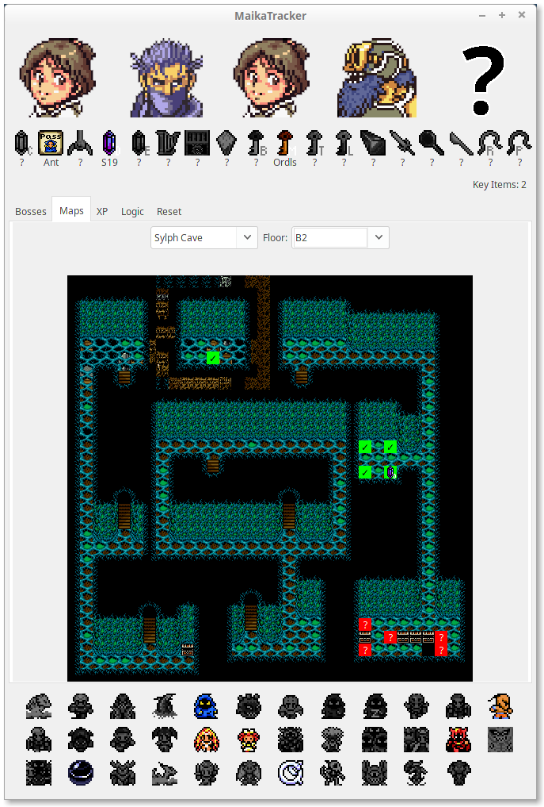

# MaikaTracker

MaikaTracker is a tracking and information resource for [Final Fantasy IV Free Enterprise](http://ff4fe.com).

By sg4e.



## Features

* Party, key-item, and boss tracking
* Boss-scaling stats for every slot and boss
* D Machin XP calculator (sorry, this one is a little rough around the edges; experiment with it to figure out how it works)
* Logic tracking based on acquired key items (now with support of all flagsets!)
* Maps of every trapped-chest location and codes for each chest for efficient 2v2 communication

## How to use

### Players

Click on the tab at the top of this repository that says "releases". Download the file under "Assets" that ends in `.jar`. When it downloads, double-click to run and you're done!

If you can't run the file or get an error, your system may not have the required version of Java installed. MaikaTracker requires Java 8 or later (either JRE or JDK). [Java is a free download from Oracle](https://www.oracle.com/technetwork/java/javase/downloads/index.html) and other software providers.

Please report bugs under the "Issues" tab.

### Developers (how to build MaikaTracker)

MaikaTracker depends on FF4StatsLib. I haven't set up that repo in Maven yet, so for now you have to manage this dependency manually:

```sh
git clone git@github.com:sg4e/FF4StatsLib.git
cd FF4StatsLib
./gradlew build   # gradlew.bat build on Windows systems
cd ..
```

Clone and build MaikaTracker. Note that MaikaTracker expects FF4StatsLib and MaikaTracker to have the same parent directory:

```sh
git clone git@github.com:sg4e/MaikaTracker.git
cd MaikaTracker
./gradlew build   # gradlew.bat build on Windows systems
```

The `.jar` binary will be output to `MaikaTracker/build/libs`.

For now, MaikaTracker logs all error output to `stdout`. MaikaTracker can be run from command line as `java -jar MaikaTracker.jar`.

## Code contributions

MaikaTracker is a project I enjoy working on and experimenting with new features as I come up with ideas playing FF4FE. Pull requests for bug fixes are appreciated, but pull requests with new features or redesign may be declined if they may be hard to maintain with features in new releases or simply because I have an idea for a different approach I'd like to take on in the future. Developers are more than welcome to fork and share their own variations of MaikaTracker as indicated in the [license](https://github.com/sg4e/MaikaTracker/blob/master/LICENSE.txt).

MaikaTracker makes use of [Netbeans GUI Builder](https://netbeans.org/kb/docs/java/quickstart-gui.html) to autogenerate GUI code. Any PR that alters this autogenerated code must be compatible with the GUI Builder. 

## 3rd-party assets

Maps were rendered by aexoden, who is also the author of [an excellent map-navigation resource](https://ff4kb.aexoden.com/tools/map-viewer/).

The D. Machin encounter-manipulation image was created by Myself086.

This repository contains some 3rd-party assets, which are provided under different licenses from the codebase. These are specified below:

Key-item and boss icons (`src/main/resources/key-items`) are by SchalaKitty. All rights reserved. Used with permission. Derivative projects will need to contact SchalaKitty for permission to use these assets. See http://schala-kitty.net/ff4fe-tracker/

Character sprites are copyright Nintendo.

## Who's Maika?

Maika Sakuranomiya is the main character in the [*Blend S* anime series](https://myanimelist.net/anime/34618/Blend_S). It's a good watch if you enjoy Slice of Life comedy with fluff.
